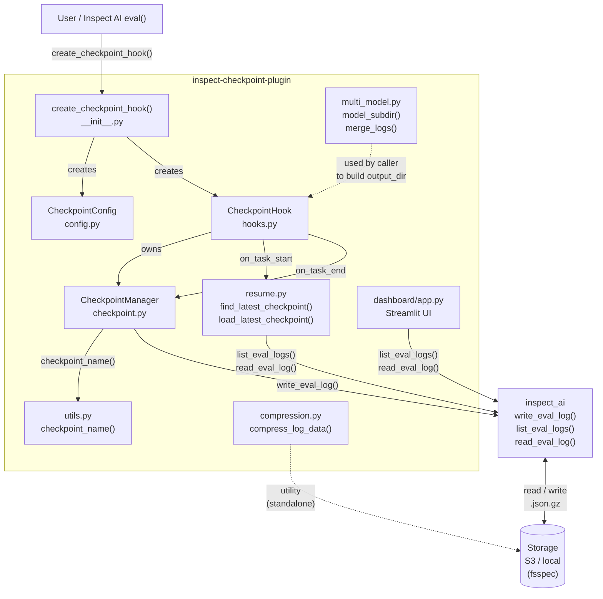
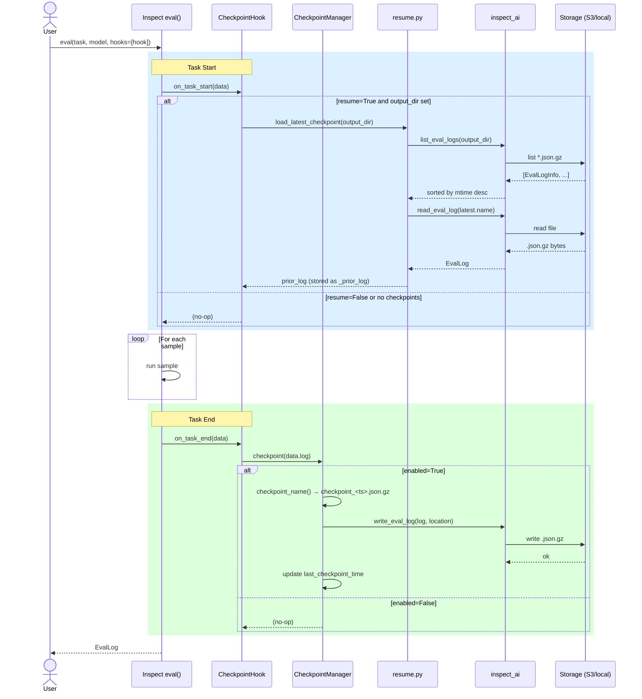
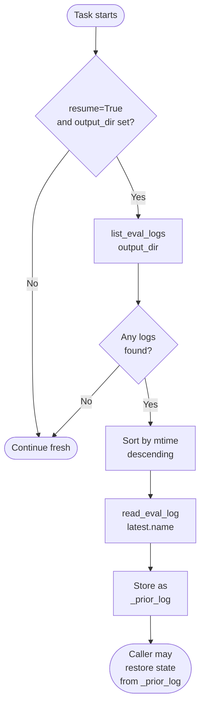
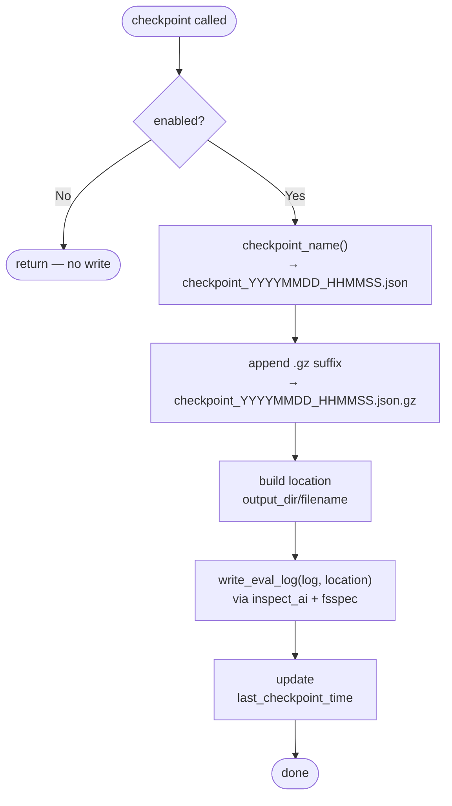
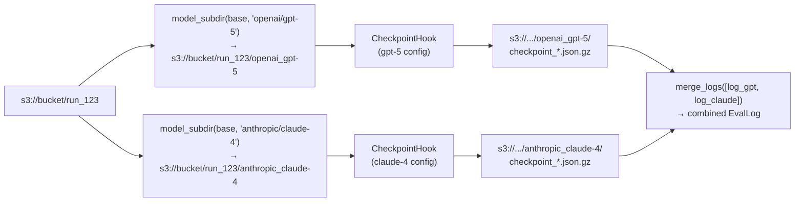
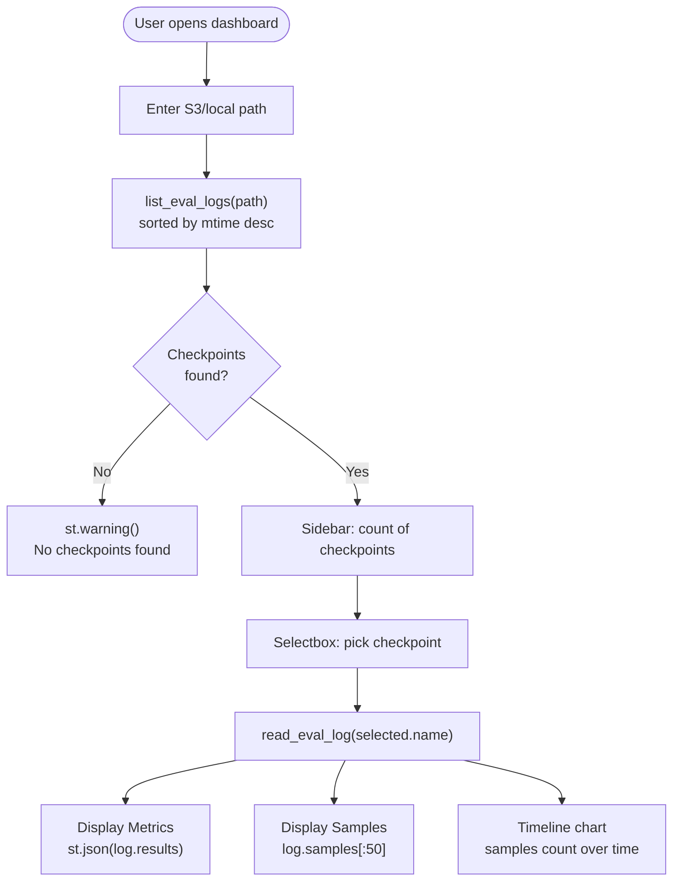

# Inspect Checkpoint Plugin — Workflow

## Component Overview

---

## Eval Lifecycle Sequence

---

## Resume Flow

---

## Checkpoint Write Flow

---

## Multi-Model Setup

---

## Dashboard Flow

